Senior Mobile Apps Developer with 8+ years of experience. My career includes architecture & developement of app solutions for Corporates/Individual clients in Dubai, US and Pakistan.  

<b>👨‍💻 Language stack</b>   
Swift | Obj-C | Kotlin | Java | PHP | Nodejs | Reactjs | ReactNative | Angular | Typescript

#  iOS 

## [Cupz](https://apps.apple.com/us/app/cupz-coffee-save/id1457236593)

Cupz is the first coffee ordering system in Kuwait that provides the end users with a guaranteed cashback along with the enjoyable user experience design of the App, and much further benefits for both the users and the vendors.

### My Role ###

### Technologies ###
Swift(4-5) | Firebase | CoreLocation | Hero | SwiftJWT | MaterialComponents-iOS | lottie-ios

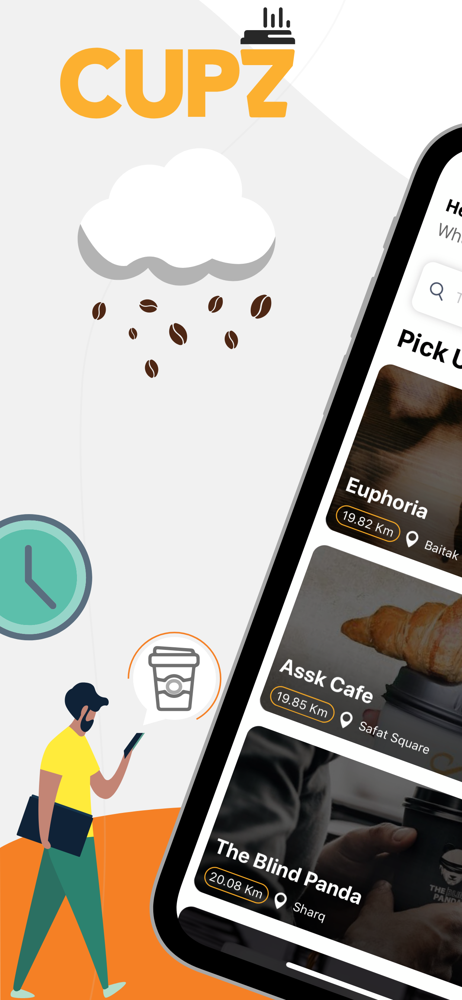&nbsp;&nbsp;
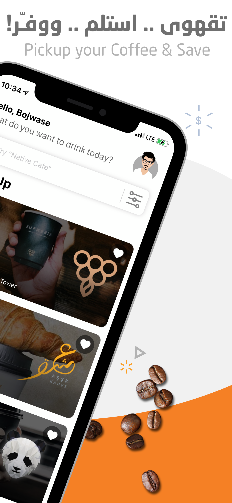&nbsp;&nbsp;
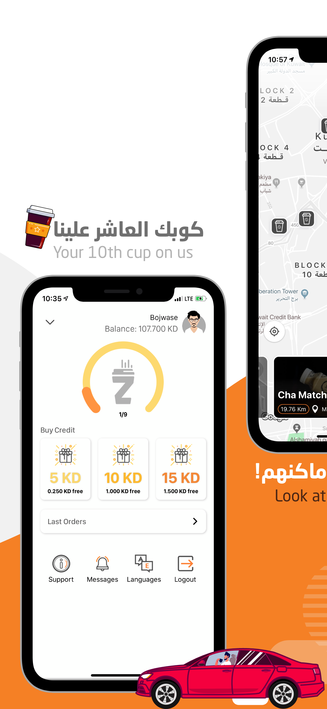&nbsp;&nbsp;
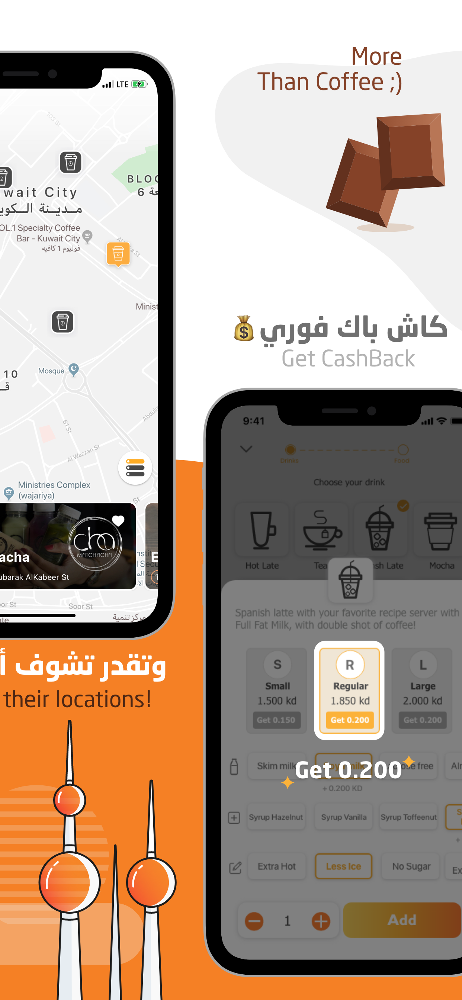

## [Dukkaani](https://apps.apple.com/ae/app/dukkaani-دكاني/id1048611351)

Dukkaani is a pan Arab smart shopping platform transforming all shopping stores to sell their products online and we started in UAE as beginning, also it is the only application that provides all grocery items supported by clear images.

Groceries delivered to you in just a few clicks! No need to go out to the supermarket or local store. Access the app from anywhere, select a store, browse products and click to buy!

Buyer can have it delivered to any address-home, office or the park.

### My Role ###

### Technologies ###
Swift(4-5) | Firebase | Firebase Messaging | Firestore | CoreLocation | CoreData | Intercom | Hero | SwiftJWT | Facebook SDK | lottie-ios | CI/CD -> Fastlane

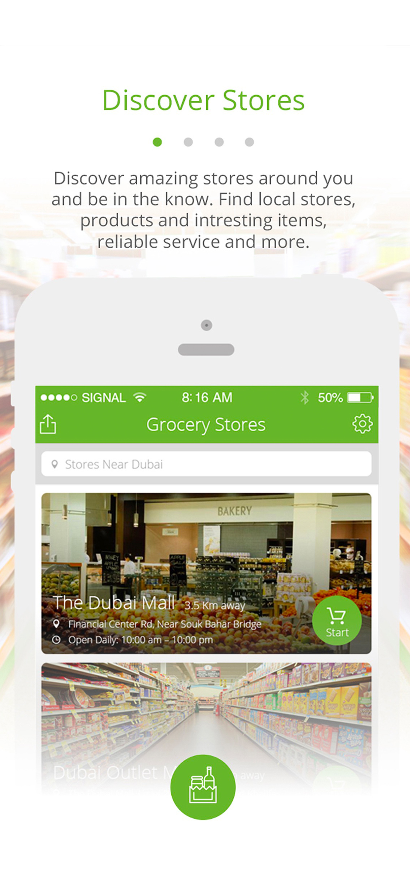&nbsp;&nbsp;
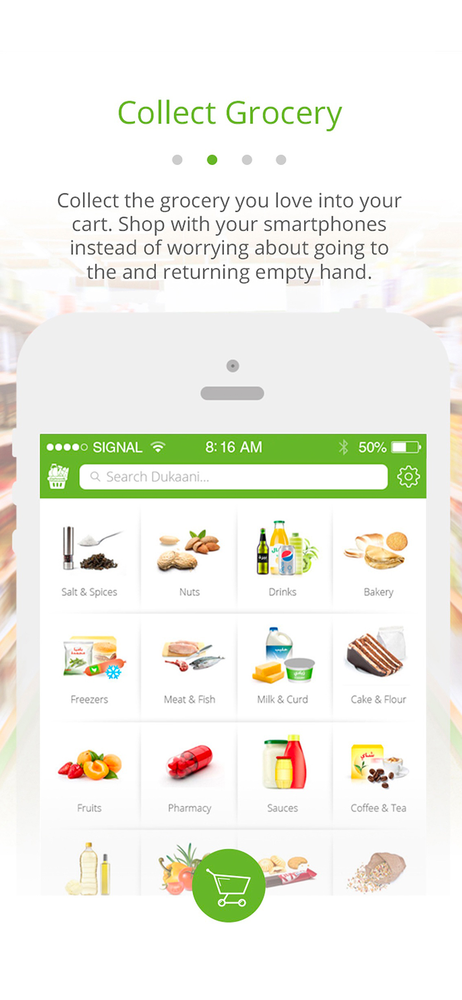&nbsp;&nbsp;
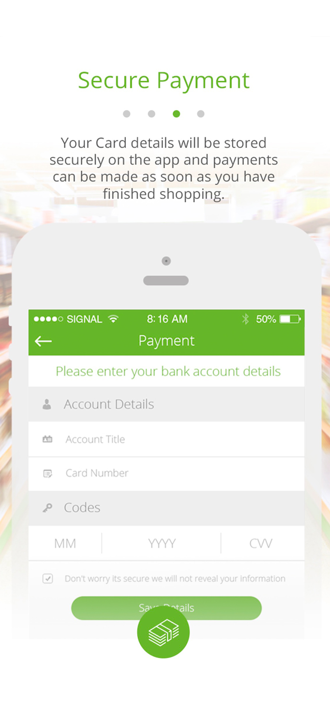&nbsp;&nbsp;
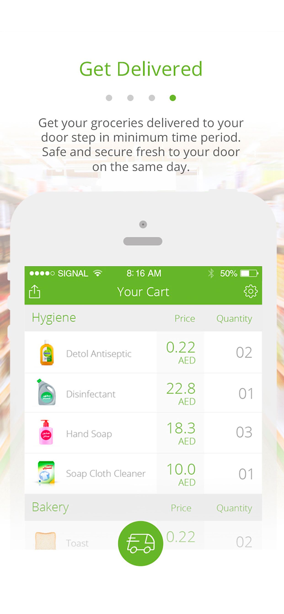

## [Port of Peri Peri](https://apps.apple.com/us/app/the-port-of-peri-peri/id1478917635)

The Port of Peri Peri app is a convenient way to skip the line and order ahead. Rewards are built right in, so you’ll collect Chillies and start earning free drinks and food with every purchase.

Pay in store
Save time and earn Rewards when you pay with The Port of Peri Peri app at many stores in the U.S.

### My Role ###

### Technologies ###
Swift(4-5) | Firebase | CoreLocation | Hero | SwiftJWT | Stripe | lottie-ios | QR Codes 

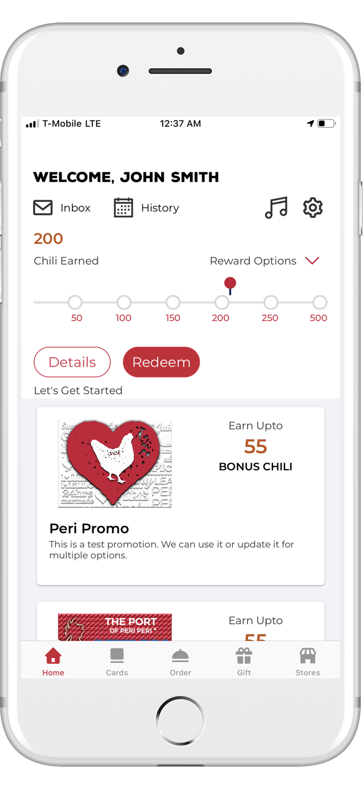&nbsp;&nbsp;
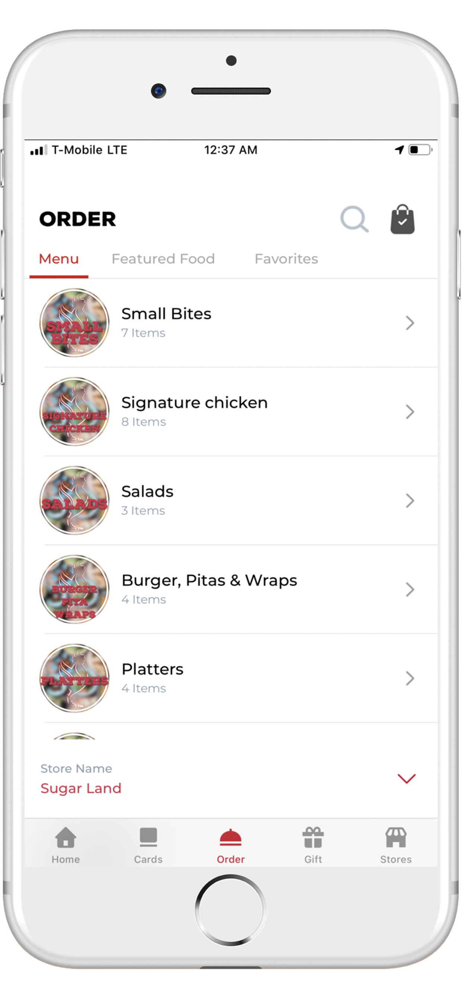&nbsp;&nbsp;
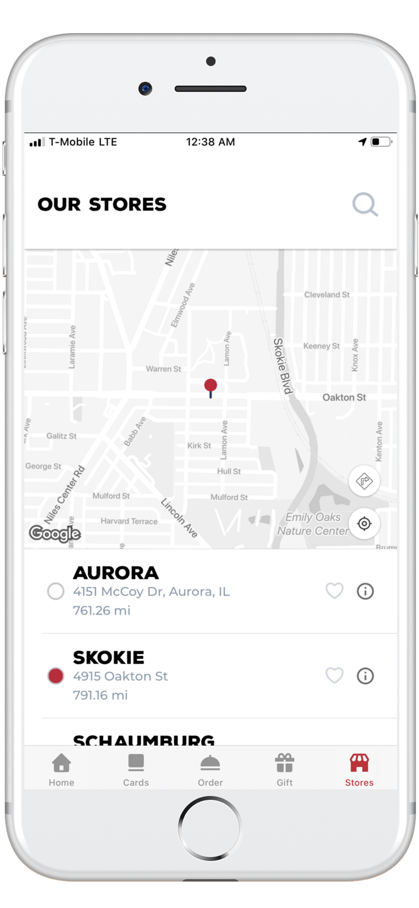&nbsp;&nbsp;
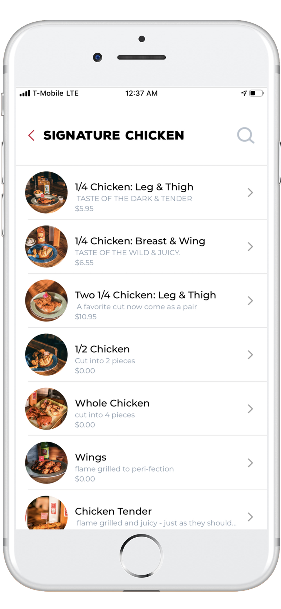

# 📱 Android

## [BlinkChat](https://play.google.com/store/apps/details?id=com.devicebee.linkedinChat)

BlinkChat is the new app that keeps you connected to your most values network, your. With BlinkChat, you can instantly chat with whoever is online from your network, sending offline messages is also a breeze because once your recipient is available, they'll receive your instant message. 

BlinkChat is for those that need to keep in touch with their friends and families with just easy clicks and securely.

### My Role ###

### Technologies ###
Swift(4-5), Firebase, CoreLocation, Hero, SwiftJWT, MaterialComponentsiOS, lottie-ios, CI/CD -> Fastlane

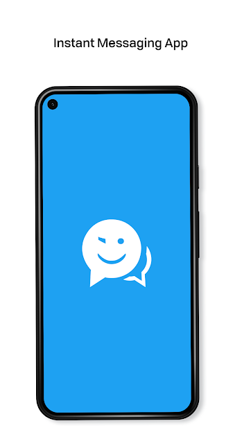
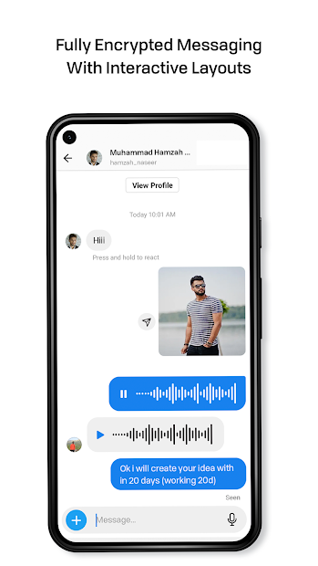
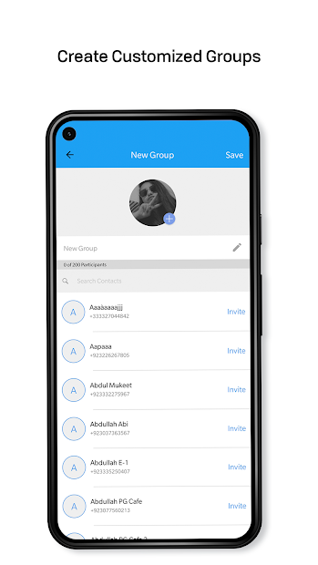
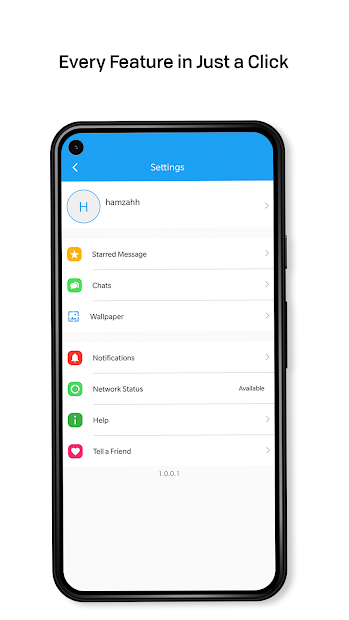

## [LG Sales Control](#)

### My Role ###

### Technologies ###
Swift(4-5), Firebase, CoreLocation, Hero, SwiftJWT, MaterialComponentsiOS, lottie-ios, CI/CD -> Fastlane

&nbsp;&nbsp;&nbsp;&nbsp;&nbsp;
&nbsp;&nbsp;&nbsp;&nbsp;&nbsp;

# 💻 Front-End

## [Lazzy](http://www.lazzy.com)

### My Role ###

### Technologies ###
Reactjs | Material Components | CoreLocation, Hero, SwiftJWT, MaterialComponentsiOS, lottie-ios, CI/CD -> Fastlane

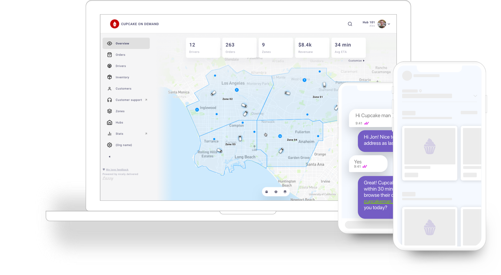

# Other Projects

### iOS

1. [Novio](https://apps.apple.com/tr/app/novio/id1511527011)
2. [Shitswie](https://apps.apple.com/sa/app/shitswee/id1503739113)
3. [The Vow](https://apps.apple.com/us/app/the-vow-ring-finder/id509902433)

### Android

1. [NEXT - Book a ride in few taps](https://play.google.com/store/apps/details?id=com.devicebee.app.nextcar&hl=en&gl=US)

### Front End

1. [SHIFT Portal](https://manage.tryshiftt.com/)

# Open Source Contributions

##  
An easy multiple image picker controller for photo library.

##  
An easy multiple image picker controller for photo library.

##  
An easy multiple image picker controller for photo library.

## Contact Info:

- Email: ee_umar@yahoo.com
- LinkedIn: [Muhammad Umar](https://www.linkedin.com/in/muhammad-umar-47047455/)
- Whats App: [Phone](https://api.whatsapp.com/send?phone=+447759474455)
- Scan QR Code

