Senior Mobile Apps Developer with 8+ years of experience. My career includes architecture & developement of app solutions for Corporates/Individual clients in Dubai, UK, US and Pakistan.  

<b>👨‍💻 Language stack</b>   
Swift | Obj-C | Kotlin | Java | PHP | Nodejs | Reactjs | ReactNative | Angular | Typescript

#  iOS 

## [Cupz](https://apps.apple.com/us/app/cupz-coffee-save/id1457236593)

Cupz is the first coffee ordering system in Kuwait that provides the end users with a guaranteed cashback along with the enjoyable user experience design of the App, and much further benefits for both the users and the vendors.

### My Role ###

Sole iOS developer. Implemented both app and firebase architecture as per clients requirments and business logic. Entire solution includes mobile apps iOS/Android, firebase functions and angular based backend portal for admins.

### Technologies ###
Swift(4-5) | Firebase | CoreLocation | Hero | SwiftJWT | MaterialComponents-iOS | Storyboards | lottie-ios | Firebase Functions

&nbsp;&nbsp;
&nbsp;&nbsp;
&nbsp;&nbsp;

## [Dukkaani](https://apps.apple.com/ae/app/dukkaani-دكاني/id1048611351)

Dukkaani is a pan Arab smart shopping platform transforming all shopping stores to sell their products online and we started in UAE as beginning, also it is the only application that provides all grocery items supported by clear images.

Groceries delivered to you in just a few clicks! No need to go out to the supermarket or local store. Access the app from anywhere, select a store, browse products and click to buy!

Buyer can have it delivered to any address-home, office or the park.

### My Role ###
Team Lead & Architect for Dukkaani mobile apps (iOS/Android). My resposibilites included complete structural architecture and development of iOS application and create a complete app and backend architecture based on requirements. The architecture also includes AI based smart reporting system. 

### Technologies ###
Swift(4-5) | Firebase | Firebase Messaging | Firestore | CoreLocation | Storyboards | CoreData | Intercom | Hero | SwiftJWT | Facebook SDK | XCTests | lottie-ios | CD -> Fastlane

&nbsp;&nbsp;
&nbsp;&nbsp;
&nbsp;&nbsp;

## [Deal Bazzar](https://apps.apple.com/us/app/deal-bazzar/id1436691938)

Deal Bazzar is the biggest discount saving App in Pakistan. Through Deal Bazzar you'll find offers, discounts, coupons from popular restaurants, Saloons and food stores etc. All discounts in Deal Bazzar are free and are shown directly on your phone's screen for you to show the cashier.

### My Role ###

Team Lead & Architect for iOS app. The application is a startup and my resposibilites included complete structural architecture and development of iOS application.

### Technologies ###
Swift 4 | Firebase | CoreLocation | Hero | SwiftJWT | Alamofire | GoogleMaps | UBER SDK | Mixpanel | Storyboards

&nbsp;&nbsp;
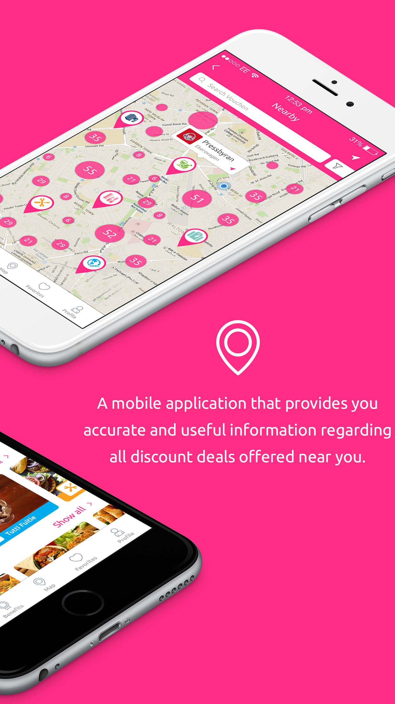&nbsp;&nbsp;
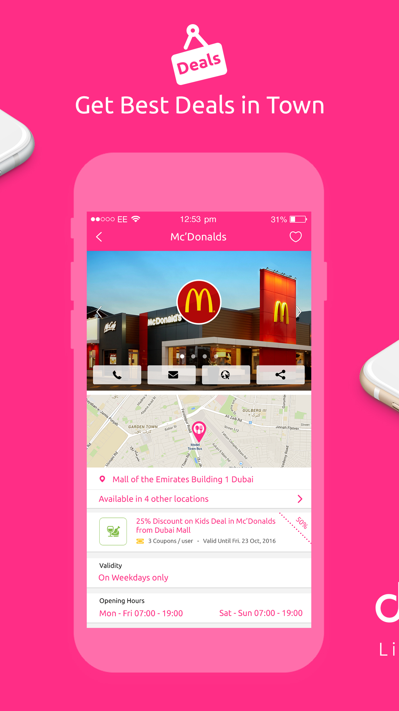&nbsp;&nbsp;
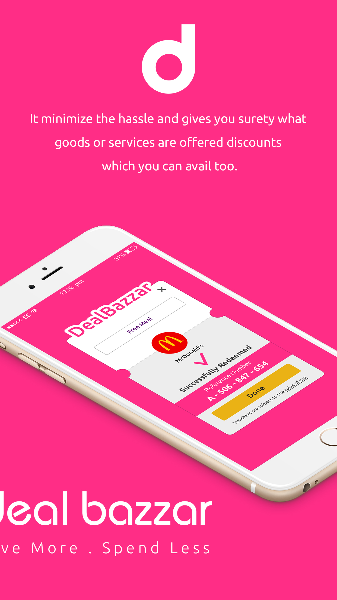

# 📱 Android

## [BlinkChat](https://play.google.com/store/apps/details?id=com.devicebee.linkedinChat)

BlinkChat is the new app that keeps you connected to your most values network, your. With BlinkChat, you can instantly chat with whoever is online from your network, sending offline messages is also a breeze because once your recipient is available, they'll receive your instant message. 

BlinkChat is for those that need to keep in touch with their friends and families with just easy clicks and securely.

### My Role ###
Team Lead & Architect. I oversaw the development of iOS app and developed android version. The communication protocols include Socketio based server enhanced with firebase.

### Technologies ###
Java | Firebase | Google APIs | Retrofit | Facebook SDK | Picasso | Rebus-Utils | JUnit | Socketio

## [LG Sales Control](#)
LG Sales control is an in house app for LG middle east sales team. The app handles daily operations of sales team.
### My Role ###
I performed development as an android developer.

### Technologies ###
Java | Firebase | Google APIs | Retrofit | And-Camera | Picasso | Rebus-Utils | Mockito | JUnit

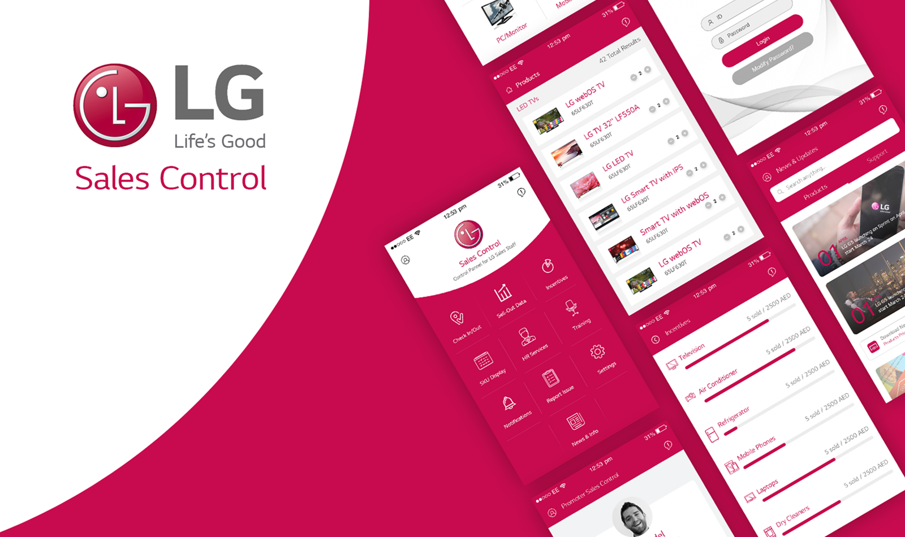

## [Recovery](https://play.google.com/store/apps/details?id=com.devicebee.recovery)

Recovery is an on demand application that allows the customers to immediately book a recovery service using the app within just few taps. You will never be stuck on the road again, Recovery covers the whole UAE. Recovery will tow your vehicle to your favorite garage, or  can recover your car so you are back on the road in no time. Flat tire? Out of fuel? stuck somewhere? battery died? No problem!

The application connects with the available service providers in the area according to user's set location.

### My Role ###
Team Lead and android developer. The application uses event driver and socketio based architectural pattern as communication protocls. 

### Technologies ###
Java | Firebase | Google APIs | Retrofit | And-Camera | Picasso | Socketio | Google Maps

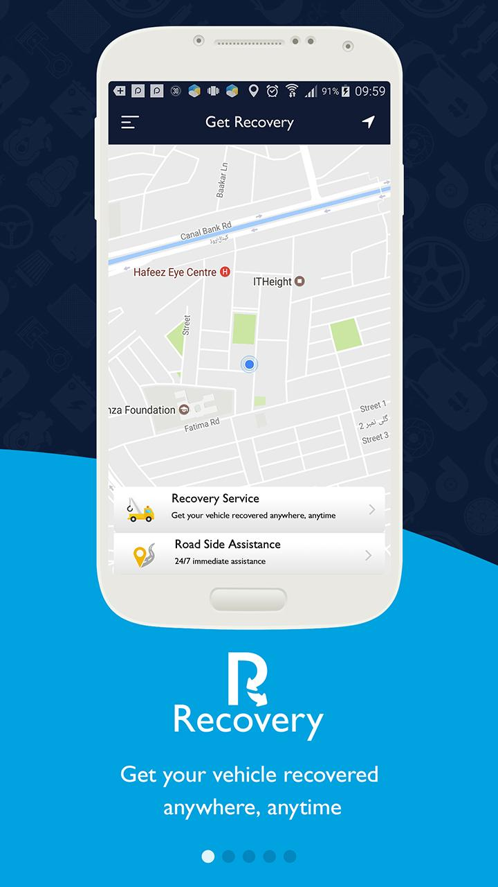
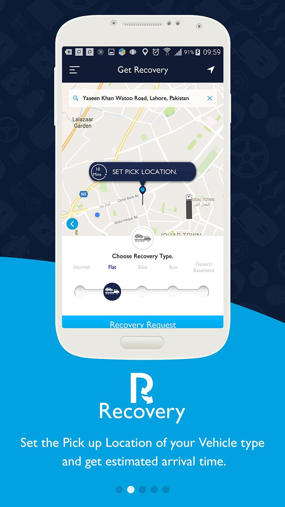
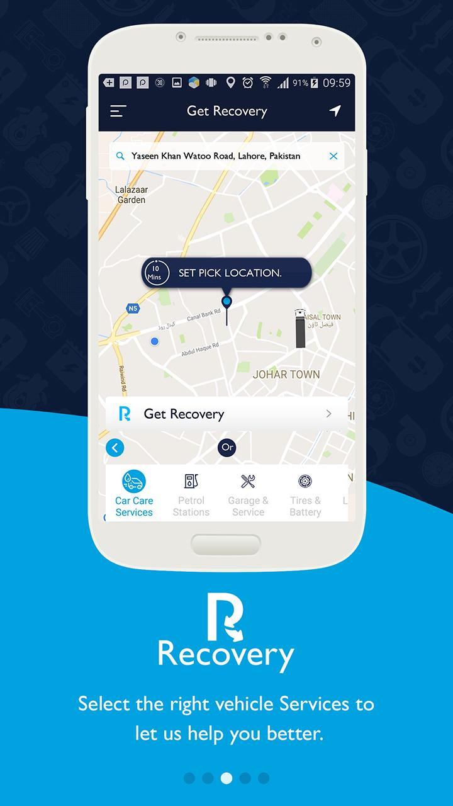
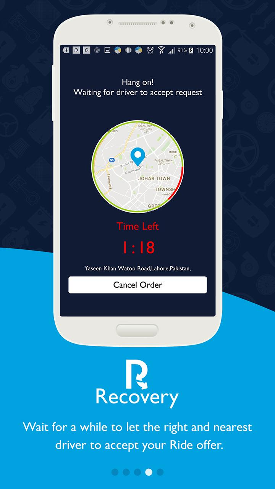

# 💻 Front-End

## [Lazzy](https://www.lazzy.com)

Lazzy designs, develops, and deploys small to enterprise scale delivery technology solutions for companies who need to integrate or expand their delivery operations over multiple internet channels including phone, web, mobile web, and mobile applications.

### My Role ###
As a front end developer, I updated the existing management system ensuring the stability of the system and adding new features and modules.

### Technologies ###
Reactjs | Material UI Components | AWS | SWR | Loadash | React Hooks | React Virtualized | Context API

## [SHIFT Portal](https://manage.tryshiftt.com/)

With shift you will move to the next level in the online business space. SHIFT provide you with your own customizable e-store that will suit all your needs. Available with In-depth data on a user-friendly dashboard to help track your Shift activity.

SHIFT portal is a startup with a friend. The system works on the principle of shopify but similar and is designed to target micro as well as macro businesses.

### My Role ###
Sole architect and solution developer.

### Technologies ###
Angular | Material UI Components | Ng Zorro | Typescript | Firestore | Firebase | Google Maps | Automation | Elastic Search

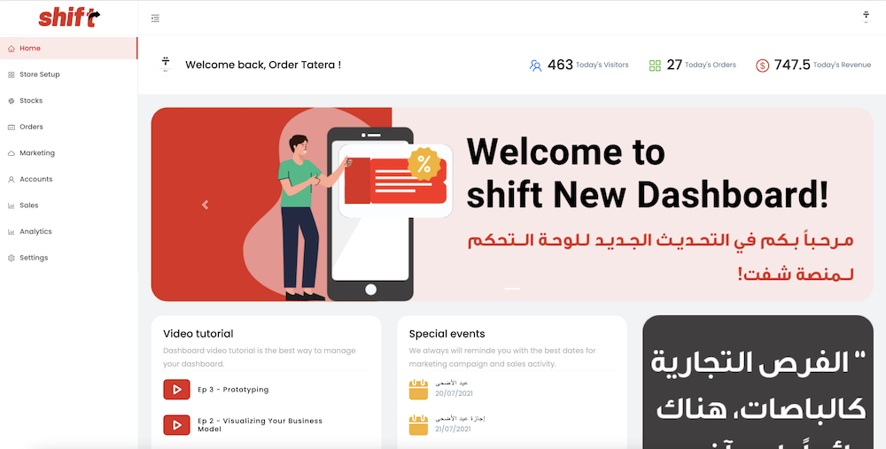

# Other Projects

### iOS

1. [Novio](https://apps.apple.com/tr/app/novio/id1511527011)
2. [Shitswee?](https://apps.apple.com/sa/app/shitswee/id1503739113)
3. [The Vow](https://apps.apple.com/us/app/the-vow-ring-finder/id509902433)
4. [Tect O Trak](https://apps.apple.com/gb/app/tect-o-trak/id1175005465)
5. [Tasweet](https://apps.apple.com/us/app/تصويت/id1539950284)
6. [Wajeeh](https://apps.apple.com/us/app/id1316899768)

### Android

1. [NEXT - Book a ride in few taps](https://play.google.com/store/apps/details?id=com.devicebee.app.nextcar)
2. [Tnerit](https://play.google.com/store/apps/details?id=com.devicebee.tnerit)
3. [Eros](https://play.google.com/store/apps/details?id=com.devicebee.eros)
4. [Sicuro](https://sicurogroup.com)  

# Open Source Contributions

## [Animated Star Rating](https://github.com/zelin/Animated-Star-Rating) 
A star view to set rating in an animated way

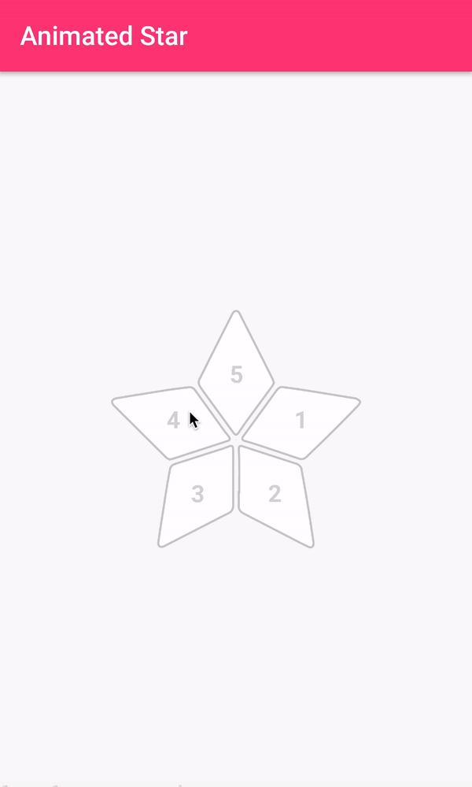

## [Ring Sizer]() 
Ring Sizer is a simple widget to find the ring size by placing ring on iPhone/iPad screen

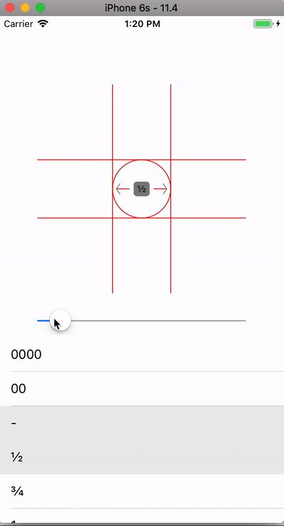

## Contact Info:

- Email: ee_umar@yahoo.com
- LinkedIn: [Muhammad Umar](https://www.linkedin.com/in/muhammad-umar-47047455/)
- Whats App: [Phone](https://api.whatsapp.com/send?phone=+447759474455)
- Scan QR Code

